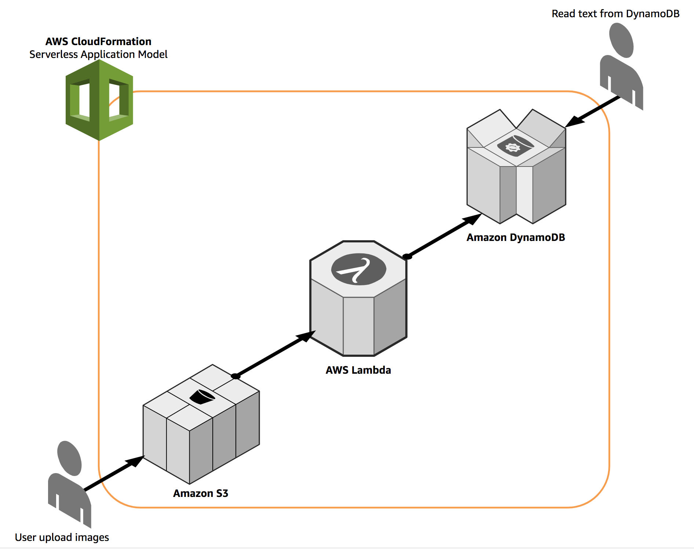

# Recognize text in images using OCR with AWS Lambda

This repo contains a [AWS Lambda](https://aws.amazon.com/lambda/) function which uses [Tesseract](https://github.com/tesseract-ocr/tesseract) and [TesserOCR](https://github.com/sirfz/tesserocr) to recognize text in the images which got uploaded to the specific S3 bucket. It will write the recognized text in a [Amazon DynamoDB](https://aws.amazon.com/dynamodb/) table.

> NOTE: It supports JPEG, PNG & TIFF files.


## Architecture



## Prerequisites

*   AWS Account with permission to CloudFormation, S3, Lambda, DynamoDB and IAM.
*   Install AWS CLI and configure the credentials.
*   Git client

## Steps to deploy this Serverless application

1.  Clone this repo and get in to the directory 'lambda-ocr'.

2.  Create the `Serverless Application Model` package using CLI. For `--s3-bucket` parameter, provide a S3 bucket in the same region where you will be launching the CloudFormation template; it will be where the packaged lambda zip file will be uploaded.
    ```
    aws cloudformation package --template-file template.yml --s3-bucket <S3_Bucket_To_Upload_Lambda_Zip> --output-template-file transformed.yml

    Uploading to 62b0c8822733588d0b00c045a772de1c  88849671 / 88849671.0  (100.00%)
    Successfully packaged artifacts and wrote output template to file transformed.yml.
    Execute the following command to deploy the packaged template
    aws cloudformation deploy --template-file transformed.yml --stack-name <YOUR STACK NAME>
    ```

3.  Deploy the application using the following CloudFormation command. Update any of the parameters as needed.
    ```
    aws cloudformation deploy --template-file transformed.yml --stack-name serverless-ocr --capabilities CAPABILITY_IAM --region eu-west-1

    Waiting for changeset to be created..
    Waiting for stack create/update to complete
    Successfully created/updated stack - serverless-ocr
    ```

4.  Once the stack got created successfully you shall get the S3 Bucket name where images should be uploaded and DynamoDB table where the recognized text will be uploaded.
    ```
    aws cloudformation describe-stacks --stack-name serverless-ocr --region eu-west-1 --query 'Stacks[*].Outputs' --output table
    -------------------------------------------------------------------------------------------------------------------
    |                                                     DescribeStacks                                              |
    +---------------------------------------------------+------------------+------------------------------------------+
    |                        Description                |    OutputKey     |     OutputValue                          |
    +-----------------------------------------------------------+------------------+----------------------------------+
    |  S3 Bucket where the images needs to be uploaded. |  ImageBucket     |  serverless-ocr-eu-west-1-123456789012   |
    |  DynamoDB table where the text will be stored.    |  OutputTextTable |  lambda-ocr-serverless-ocr               |
    +-----------------------------------------------------------+------------------+----------------------------------+
    ```

5.  Upload the images to the S3 bucket obtained from the previous step.

6.  After few minutes Lambda will automatically get triggered based on the S3 upload event and recognize the text in the image and update that in the DynamoDB table.

